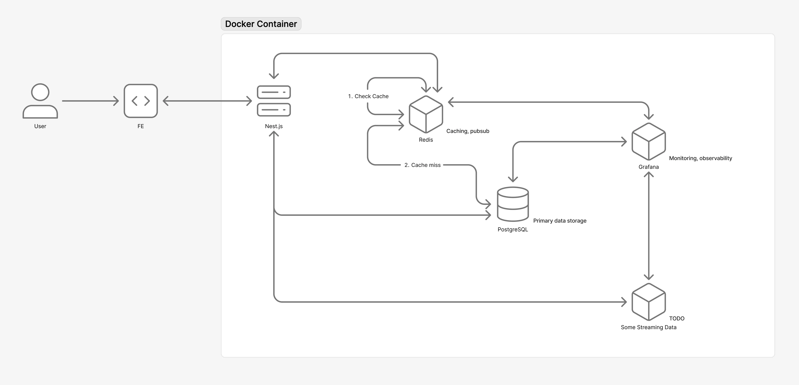

The <abbr title="Minimal Viable Product">MVP</abbr> of the Multitenant Analytics Application (MtAA) is a dashboard for a Law Firm. The system will support <a href="https://en.wikipedia.org/wiki/Multitenancy">multitenancy</a>, analytics, and essential admin features.

I've divided the project up into 6 phases:

- Phase 1: Foundation &amp; Parallel FE/BE Setup
- Phase 2: Authentication &amp; Multitenancy
- Phase 3: Analytics Foundation &amp; Core Visualization
- Phase 4: Law Firm Features &amp; Performance
- Phase 5: Core User Management
- Phase 6: Analytics &amp; Advanced Features

## Architecture

